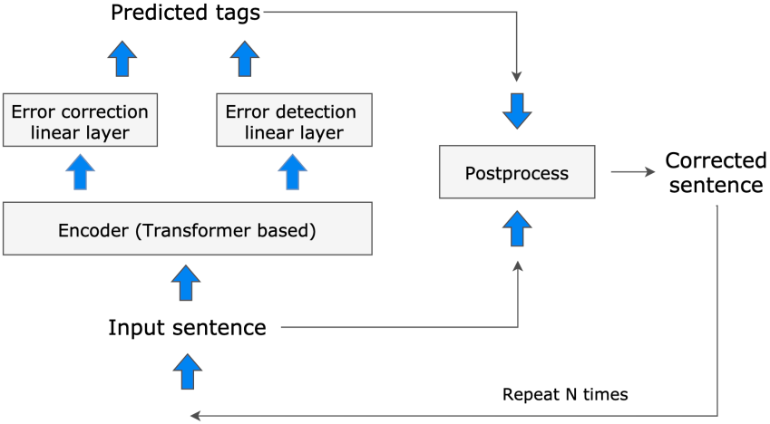

# Japanese Grammatical Error Correction - JGEC

JGEC is described in the paper [GECToR -Grammatical Error Correction: Tag, Not Rewrite](https://arxiv.org/abs/2005.12592), but it is implemented for Japanese. This project's code is based on the official implementation [gector](https://github.com/grammarly/gector).

## Model Architecture

The model consists of a [bert-base-japanese](https://huggingface.co/cl-tohoku/bert-base-japanese-v2) and two linear classification heads, one for `labels` and one for `detect`. 

`labels` predicts a specific edit transformation (`$KEEP`, `$DELETE`, `$APPEND_x`, etc), and `detect` predicts whether the token is `CORRECT` or `INCORRECT`. The results from the two are used to make a prediction. The predicted transformations are then applied to the errorful input sentence to obtain a corrected sentence.

Furthermore, in some cases, one pass of predicted transformations is not sufficient to transform the errorful sentence to the target sentence. Therefore, we repeat the process again on the result of the previous pass of transformations, until the model predicts that the sentence no longer contains incorrect tokens.

<figure>

<figcaption>Inference using iterative sequence-tagging (https://www.grammarly.com/blog/engineering/gec-tag-not-rewrite/)</figcaption>
</figure>

## Datasets

- [Japanese Wikipedia dump](https://dumps.wikimedia.your.org/jawiki/20220820/jawiki-20220820-pages-articles-multistream.xml.bz2), extracted with [WikiExtractor](https://github.com/attardi/wikiextractor), synthetic errors generated using preprocessing scripts
  - 19,841,767 training sentences
- [NAIST Lang8 Learner Corpora](https://sites.google.com/site/naistlang8corpora/)
  - 6,066,306 training sentences (generated from 3,084,0376 original sentences)
- [PheMT](https://github.com/cl-tohoku/PheMT), extracted from this [paper](https://arxiv.org/pdf/2011.02121.pdf)
  - 1,409 training sentences
- [BSD](https://github.com/tsuruoka-lab/BSD), extracted from this [paper](https://arxiv.org/pdf/2008.01940.pdf)
  - 47,814 training sentences
- [jpn-eng](http://www.manythings.org/anki/jpn-eng.zip)
  - 98,507 training sentences
- [jpn-address](https://drive.google.com/drive/folders/1kBz8wbYztRkgz2nQgQvBD1wkWz8Jwz1-?usp=sharing)
  - 116,494 training sentences

### Synthetically Generated Error Corpus

The **JaWiki**, **Lang8**, **BSD**, **PheMT**, **jpn-eng**, and **jp_address** are to synthetically generate errorful sentences, with a method similar to [Awasthi et al. 2019](https://github.com/awasthiabhijeet/PIE/tree/master/errorify), but with adjustments for Japanese. The details of the implementation can be found in the [preprocessing code](https://github.com/phkhanhtrinh23/JGEC/blob/main/utils/preprocess.py) in this repository.

## Training
Install the requirements:
```
pip install -r requirements.txt
```

The model was trained in Colab with GPUs on each corpus with the following hyperparameters (default is used if unspecified):
```
python ./utils/combine.py
python ./utils/preprocess.py
bash train.sh
```

## Demo
```python
from module import JGEC

obj = JGEC()
source_sents = ["そして10時くらいに、喫茶店でレーシャルとジョノサンとベルに会いました",
                "一緒にコーヒーを飲みながら、話しました。"]

res = obj(source_sents)

print("Results:", res)
# Results: ['そして10時くらいに、喫茶店でレーシャルとジョノサンとベルに会いました', 
#         '一緒にコーヒーを飲みながら、話しました。']
```

## Inference
Trained weights can be downloaded [here](https://drive.google.com/file/d/1nhWzDZnZKxLvqwYMLlwRNOkMK2aXv4-5/view?usp=sharing). The trained weights have been pre-trained on JaWiki and Lang8.

Extract `model.zip` to the `./utils/data/model` directory. You should have the following folder structure:

```
JGEC/
  utils/
    data/
      model/
        checkpoint
        model_checkpoint.data-00000-of-00001
        model_checkpoint.index
```

After downloading and extracting the weights, the demo app can be run with the command 
```python
python main.py
```

You may need to `pip install flask` if Flask is not already installed.

## Evaluation

The model can be evaluated with `evaluate.py` on a parallel sentences corpus. The evaluation corpus used was [TMU Evaluation Corpus for Japanese Learners (TEC_JL)](https://github.com/koyama-aomi/TEC-JL), and the metric is GLEU score.

### TEC-JL Results
| Method                    | GLEU     |
| ------------------------- | -------- |
| Chollampatt and Ng, 2018  | 0.739    |
| **JGEC**            | **0.860**|


## Credit
[jonnyli1125
](https://github.com/jonnyli1125)
